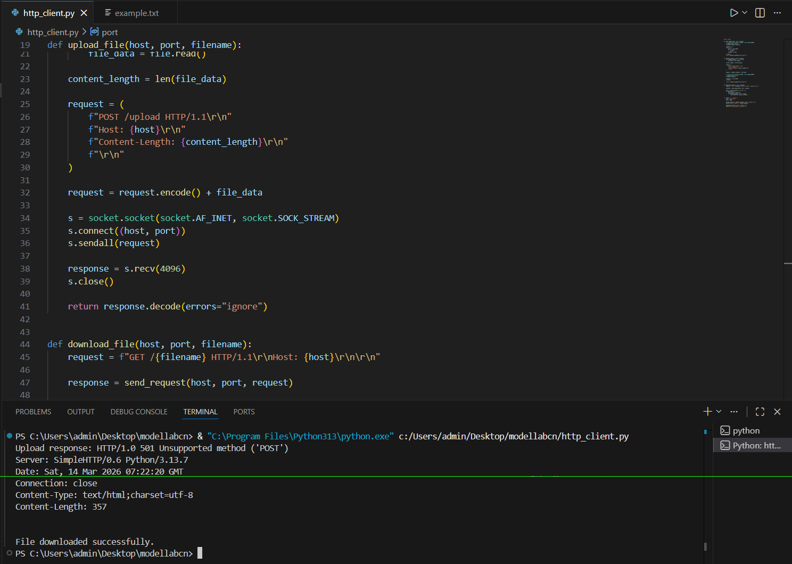

# Exp: 5a_Create_Socket_for_HTTP_for_webpage_upload_and_download
### NAME: HARI PRIYA M
### REGISTER NO : 212224240047
## AIM :
To write a PYTHON program for socket for HTTP for web page upload and download
## Algorithm

1.Start the program.
<BR>
2.Get the frame size from the user
<BR>
3.To create the frame based on the user request.
<BR>
4.To send frames to server from the client side.
<BR>
5.If your frames reach the server it will send ACK signal to client otherwise it will send NACK signal to client.
<BR>
6.Stop the program
<BR>
## Program 
```python
import socket

def send_request(host, port, request):
    s = socket.socket(socket.AF_INET, socket.SOCK_STREAM)
    s.connect((host, port))
    s.sendall(request.encode())

    response = b""
    while True:
        data = s.recv(4096)
        if not data:
            break
        response += data

    s.close()
    return response.decode(errors="ignore")


def upload_file(host, port, filename):
    with open(filename, "rb") as file:
        file_data = file.read()

    content_length = len(file_data)

    request = (
        f"POST /upload HTTP/1.1\r\n"
        f"Host: {host}\r\n"
        f"Content-Length: {content_length}\r\n"
        f"\r\n"
    )

    request = request.encode() + file_data

    s = socket.socket(socket.AF_INET, socket.SOCK_STREAM)
    s.connect((host, port))
    s.sendall(request)

    response = s.recv(4096)
    s.close()

    return response.decode(errors="ignore")


def download_file(host, port, filename):
    request = f"GET /{filename} HTTP/1.1\r\nHost: {host}\r\n\r\n"

    response = send_request(host, port, request)

    parts = response.split("\r\n\r\n", 1)
    if len(parts) > 1:
        file_content = parts[1]
        with open(filename, "wb") as file:
            file.write(file_content.encode())


if __name__ == "__main__":
    host = "127.0.0.1"
    port = 8080

    upload_response = upload_file(host, port, "example.txt")
    print("Upload response:", upload_response)

    download_file(host, port, "example.txt")
    print("File downloaded successfully.")
```
## OUTPUT


## Result
Thus the socket for HTTP for web page upload and download created and Executed
